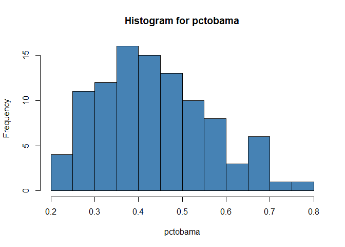
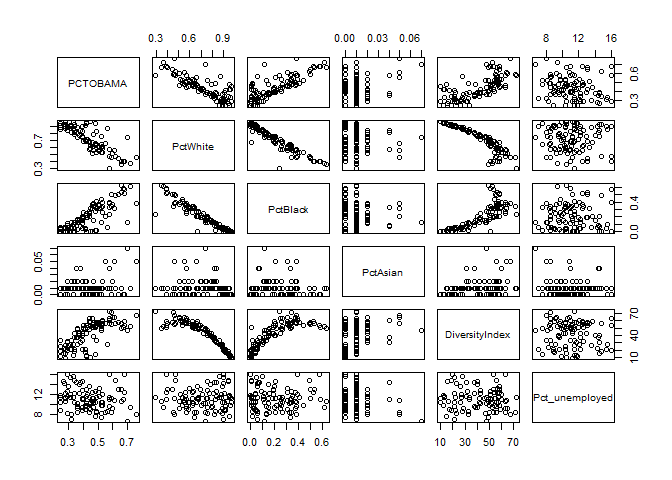

Data collected from North Carolina counties uploaded on canvas, in Files, titled Obama2012. The data contain many variables, such as percent of vote Obama received in each county, population size in 2010, population per square miles, percent of white people, …. etc


```r
##importing the Obama2012 data set to R 
library(readxl)
G<- data.frame(read_excel("C:/Users/PC/Desktop/Obama 2012.xls"))
head(G)
```

```
##   PCTOBAMA PctWhite PctBlack PctAsian DiversityIndex Pct_unemployed
## 1     0.43     0.71     0.19     0.01           50.6           12.0
## 2     0.27     0.90     0.06     0.01           22.6           14.3
## 3     0.31     0.92     0.01     0.01           21.8           11.4
## 4     0.62     0.47     0.49     0.01           55.7           14.8
## 5     0.33     0.96     0.01     0.00           13.3           11.4
## 6     0.24     0.92     0.04     0.00           18.6            8.8
```

Use percent of vote (PCTOBAMA) as the response variable and use PctWhite ($x_1$), Pct_unemployed ($x_2$), PctBlack ($x_3$), DiversityIndex ($x_4$),, and PctAsian ($x_5$), as the explanatory variables. The objective of this analysis is to build a predictive model, i.e. estimate the multiple linear regression equation. 

```r
##Defining variables
##Response variable
obama<-G$PCTOBAMA
##Explanatory variables
white<-G$PctWhite
black<-G$PctBlack
asian<-G$PctAsian
diversity<-G$DiversityIndex
unemployed<-G$Pct_unemployed
```

Let $y_i$ is the percent of votes that selected Obama in county $i=1,2,\ldots,n$. 
The model:   
$y_i |\beta,\sigma^2 \sim Noraml(\beta_0+\beta_1 x_{1i}+\beta_2 x_{2i}+\beta_3 x_{3i}+\beta_4 x_{4i}+\beta_5 x_{5i},\sigma^2)$.

The priors:  
$\beta_j \sim Normal(0,100^2),i=0,1,2,3,4,5$,         and $\sigma^2 \sim Normal(0.01,0.01)$ 

* Summarizing the data numerically and graphically.

```r
summary(G)##numeric summary of all variables in the data frame
```

```
##     PCTOBAMA         PctWhite         PctBlack         PctAsian     
##  Min.   :0.2400   Min.   :0.2900   Min.   :0.0000   Min.   :0.0000  
##  1st Qu.:0.3400   1st Qu.:0.5700   1st Qu.:0.0600   1st Qu.:0.0000  
##  Median :0.4250   Median :0.7400   Median :0.1850   Median :0.0100  
##  Mean   :0.4405   Mean   :0.7149   Mean   :0.2067   Mean   :0.0103  
##  3rd Qu.:0.5200   3rd Qu.:0.8825   3rd Qu.:0.3300   3rd Qu.:0.0100  
##  Max.   :0.7600   Max.   :0.9700   Max.   :0.6300   Max.   :0.0700  
##  DiversityIndex  Pct_unemployed 
##  Min.   : 9.70   Min.   : 6.60  
##  1st Qu.:27.20   1st Qu.: 9.55  
##  Median :46.90   Median :11.00  
##  Mean   :41.86   Mean   :11.06  
##  3rd Qu.:55.73   3rd Qu.:12.25  
##  Max.   :72.60   Max.   :16.10
```

```r
correlation <- cor(G)##calculating the correlation matrix for the variables in the data set
round(correlation, 2)##rounding the correlation coefficient to 2 dp.
```

```
##                PCTOBAMA PctWhite PctBlack PctAsian DiversityIndex
## PCTOBAMA           1.00    -0.83     0.80     0.25           0.70
## PctWhite          -0.83     1.00    -0.94    -0.07          -0.91
## PctBlack           0.80    -0.94     1.00    -0.03           0.80
## PctAsian           0.25    -0.07    -0.03     1.00           0.22
## DiversityIndex     0.70    -0.91     0.80     0.22           1.00
## Pct_unemployed    -0.16    -0.01     0.04    -0.14          -0.07
##                Pct_unemployed
## PCTOBAMA                -0.16
## PctWhite                -0.01
## PctBlack                 0.04
## PctAsian                -0.14
## DiversityIndex          -0.07
## Pct_unemployed           1.00
```

```r
hist(obama, xlab = "pctobama", ylab = "Frequency", col = "steelblue", main = "Histogram for pctobama")##histogram showing distribution of the outcome variable(percent votes for Obama)
```

<!-- -->

```r
plot(G)##plotting the scatter plots for the variables in the data sets to observe the correlation, strength and direction of the relationship
```

<!-- -->


* Fit the model using the Bayesian approach.

```r
##recalling the (r jags) package for data analysis
library(rjags)
```

```
## Loading required package: coda
```

```
## Linked to JAGS 4.3.1
```

```
## Loaded modules: basemod,bugs
```

```r
n <- length(obama)
n
```

```
## [1] 100
```

```r
multiple_linear_model = "model{
    #likelihood function- data distribution
    for(i in 1:n) {
      obama[i]  ~ dnorm(mu[i], tau2)
      mu[i]<- beta[1] + beta[2]*white[i] + beta[3]*black[i]+ beta[4]* asian[i]+ beta[5]*diversity[i]+ beta[6]*unemployed[i]
    }

    #prior for beta
    for(j in 1:6){
      beta[j] ~dnorm(0, 0.0001)
    }

    #prior for the inverse variance
    tau2 ~ dgamma(0.01, 0.01)
    sigma2  <- 1/tau2
    }"

##compile the model in JAGS
linear_model <- jags.model(textConnection(multiple_linear_model),
                              n.chains = 3,
                              data= list(obama=obama, n=n, white=white, black=black, asian=asian, diversity=diversity, unemployed=unemployed))
```

```
## Compiling model graph
##    Resolving undeclared variables
##    Allocating nodes
## Graph information:
##    Observed stochastic nodes: 100
##    Unobserved stochastic nodes: 7
##    Total graph size: 958
## 
## Initializing model
```

```r
##Draw samples
update(linear_model, 10000, progress.bar = "none"); ##burn-in for 10000 samples
samples<- coda.samples(linear_model,
              variable.names=c("beta", "sigma2"),
                n.iter=30000, progress.bar="none")
summary(samples)
```

```
## 
## Iterations = 10001:40000
## Thinning interval = 1 
## Number of chains = 3 
## Sample size per chain = 30000 
## 
## 1. Empirical mean and standard deviation for each variable,
##    plus standard error of the mean:
## 
##              Mean       SD  Naive SE Time-series SE
## beta[1]  1.176100 0.181663 6.055e-04      2.624e-02
## beta[2] -0.740682 0.167182 5.573e-04      2.036e-02
## beta[3]  0.152163 0.123495 4.117e-04      7.270e-03
## beta[4]  2.548973 0.528445 1.761e-03      4.518e-03
## beta[5] -0.003657 0.001035 3.449e-06      5.940e-05
## beta[6] -0.010007 0.002898 9.661e-06      7.211e-05
## sigma2   0.003732 0.000559 1.863e-06      3.228e-06
## 
## 2. Quantiles for each variable:
## 
##              2.5%       25%       50%       75%     97.5%
## beta[1]  0.789397  1.067990  1.175993  1.285879  1.546418
## beta[2] -1.077449 -0.840992 -0.741242 -0.639701 -0.391050
## beta[3] -0.088268  0.071252  0.151576  0.232760  0.399095
## beta[4]  1.510977  2.196191  2.546932  2.903221  3.582295
## beta[5] -0.005724 -0.004325 -0.003660 -0.002977 -0.001625
## beta[6] -0.015655 -0.011930 -0.010022 -0.008115 -0.004175
## sigma2   0.002794  0.003337  0.003678  0.004065  0.004982
```

```r
dev.new()
par(mar = c(3, 3, 2, 2))
plot(samples)
```

*	Check convergence of all the parameters

```r
##convergence diagnostics
dev.new()
par(mar = c(3, 3, 2, 2))
autocorr.plot(samples)
effectiveSize(samples)
```

```
##     beta[1]     beta[2]     beta[3]     beta[4]     beta[5]     beta[6] 
##    54.82564    75.41849   323.22723 13790.30249   351.66388  1619.56812 
##      sigma2 
## 38413.26503
```

```r
gelman.plot(samples)
```
*	Find the best regression model that has only the significant variables based on the Bayesian approach. So, if you see any insignificant explanatory variables, remove them, and re-estimate the regression equation. 


```r
##after running the regression model the variable pctblack did not have no effect on the outcome(pctobama) 95% credible set(-0.09 - 0.37) and will therefore be excluded in the final regression model

Final_linear_model = "model{
    #likelihood function- data distribution
    for(i in 1:n) {
      obama[i]  ~ dnorm(mu[i], tau2)
      mu[i]<- beta[1] + beta[2]*white[i] + beta[3]* asian[i]+ beta[4]*diversity[i]+ beta[5]*unemployed[i]
    }

    #prior for beta
    for(j in 1:5){
      beta[j] ~dnorm(0, 0.0001)
    }

    #prior for the inverse variance
    tau2 ~ dgamma(0.01, 0.01)
    sigma2  <- 1/tau2
    }"

##compile the model in JAGS
linear_model2 <- jags.model(textConnection(Final_linear_model),
                              n.chains = 5,
                              data= list(obama=obama, n=n, white=white, asian=asian, diversity=diversity, unemployed=unemployed))
```

```
## Compiling model graph
##    Resolving undeclared variables
##    Allocating nodes
## Graph information:
##    Observed stochastic nodes: 100
##    Unobserved stochastic nodes: 6
##    Total graph size: 814
## 
## Initializing model
```

```r
##Draw samples
update(linear_model2, 20000, progress.bar = "none"); ##burn-in for 20000 samples
samples<- coda.samples(linear_model2,
              variable.names=c("beta", "sigma2"),
                n.iter=50000, progress.bar="none")
summary(samples)
```

```
## 
## Iterations = 20001:70000
## Thinning interval = 1 
## Number of chains = 5 
## Sample size per chain = 50000 
## 
## 1. Empirical mean and standard deviation for each variable,
##    plus standard error of the mean:
## 
##              Mean        SD  Naive SE Time-series SE
## beta[1]  1.354070 0.1084562 2.169e-04      5.129e-03
## beta[2] -0.916536 0.0880161 1.760e-04      3.508e-03
## beta[3]  2.445390 0.5262157 1.052e-03      3.886e-03
## beta[4] -0.004132 0.0009632 1.926e-06      3.681e-05
## beta[5] -0.009994 0.0027897 5.579e-06      4.021e-05
## sigma2   0.003737 0.0005535 1.107e-06      1.656e-06
## 
## 2. Quantiles for each variable:
## 
##              2.5%       25%       50%       75%     97.5%
## beta[1]  1.135666  1.283598  1.354116  1.426106  1.566249
## beta[2] -1.088776 -0.975170 -0.917096 -0.858768 -0.739657
## beta[3]  1.410643  2.092320  2.446515  2.798256  3.480189
## beta[4] -0.006023 -0.004771 -0.004136 -0.003495 -0.002217
## beta[5] -0.015419 -0.011880 -0.010014 -0.008114 -0.004505
## sigma2   0.002804  0.003346  0.003684  0.004072  0.004970
```


